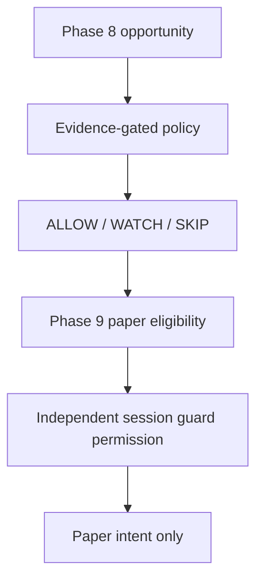

# Adaptive analytical policy — Phase 12

`qst-policy-v1`, `qst-watchdog-v1`. The application defaults to **SHADOW**.
The policy is a conservative filter over an existing Phase 8 selection. It can
return only ALLOW, WATCH or SKIP. It never creates a direction, changes a rank or
confidence, chooses another leader, or resurrects a rejected/incomplete board.
Phase 12 implements no broker execution automation.



The existing AUTO implementation, actuator, broker controls and execution
settings are unchanged. There is no policy-to-broker path. Phase 13 packaging
and Phase 14 shadow-live operational validation are outside this work.

## Frozen contracts

| Input | Contract |
|---|---|
| Features | qfe-v2 |
| Regime / strategy | qst-regime-v1 / qst-strategy-v1 |
| Ranking | qst-ranking-v1 |
| Paper outcomes | qst-paper-v1 |
| Daily session guard | qst-session-guard-v1 |
| Analytics | qst-analytics-v1 |
| Replay | qst-replay-v2 |

The policy maintains a literal compatibility table. A version mismatch is a
refusal, even if the old JSON is structurally readable. All Phase 6–11 formula,
weight, selection, outcome and accounting implementations remain unchanged.
The replay safety test now permits exactly one evidence consumer:
`policy/evidence.py`; its other execution and mutation boundaries remain intact.

## Evidence and causality

The admission boundary reads persisted `ReplayEvidence`, completed replay run
and summary records, their fold windows, and the replay's isolated Phase 9/7
records. It calls Phase 10's dataset builder and statistics. It checks matching
IDs, fingerprints, source modes, versions, completion and non-partial results.
Synthetic source modes or synthetic price provenance always reject activation.

An append-only **evidence receipt** records `evidenceAvailableAt` when Phase 12
first imports an artifact. Older Phase 10/11 records have no trustworthy policy
publication time: their event date, filesystem modification time and replay
runtime are not substitutes for that receipt. An unchanged artifact reuses its
receipt; changed content creates another receipt. Rebuild reads these receipts
with `evidenceAvailableAt <= evidenceCutoffTime` **before** fingerprinting.
Future receipts therefore cannot even change a historical snapshot ID.

Outcome membership also requires actual `resolvedAtMarketTime`, including
settlement lag, within the evidence period. An expiry timestamp alone cannot
make a late-arriving outcome available early. Fold decisions must start inside
their period; folds must be chronological and tests disjoint. A replay result
produced today cannot be injected into a policy decision from yesterday.

The evidence hierarchy is completed replay OOS evidence, then Phase 10
analytics, then conservative no-evidence behavior. Legacy Phase 10 summaries
and ResearchFinding claims alone lack repeated disjoint OOS provenance. They
are reported as insufficient/directional evidence and cannot activate a rule.
This is deliberately stricter than Phase 10's descriptive recommendation floor.

## Fixed candidate rules and admission gates

Candidate identities come from the first TRAIN window only. Supported scopes:
platform, regime, strategy × regime, and fixed 0.2-wide rank/confidence bands.
Each specialization is qualified by platform, keeping the two holding horizons
separate. No asset/hour search or large conjunction search is performed.

Phase 11's per-fold best thresholds may differ. They are **not** pooled into one
policy rule. Phase 12 remeasures each identical, predetermined predicate on raw
Phase 10 rows in every completed OOS test window. A regime or strategy first
appearing in TEST cannot become a candidate in that study.

| Gate | qst-policy-v1 minimum |
|---|---|
| TRAIN binary outcomes for the scope | 100 |
| Completed disjoint OOS folds | 3 |
| Binary outcomes in each test fold | 50 |
| Retained historical coverage | 20% |
| Meaningful directional effect | 5 percentage points |
| Evidence age | at most 30 days by default |
| Uncertainty | Phase 10 two-sided 95% Wilson intervals |

These floors cannot be configured downward. Phase 10's 50-sample research
recommendation and 10% display/research coverage floors are too permissive for
an operational analytical filter, so Phase 12 uses the stronger stated floors.

The TRAIN effect must pass the floor. A majority of OOS folds must repeat that
meaningful effect, and every remaining fold must retain its sign. Pooled Wilson
intervals must separate from the same-platform baseline interval. Platform
baseline evidence itself is compared with a 50% directional reference, not
with a payout break-even rate; it makes no profitability claim. Adverse evidence
produces SKIP; stable positive evidence lets an already eligible selection stay
ALLOW. Uncertain effects yield WATCH/no rule.

Validated specificity is strategy-regime > regime/band > platform > global;
a thin specialization falls back to broader validated evidence. A broader veto
cannot be bypassed by a narrower positive slice. Within the same scope replay
outranks analytics, then availability and stable ID break ties. Coverage shares
must come from the same source dataset. A conservative union bound subtracts
all possible veto overlap from an ALLOW region; if that cannot retain 20%, the
platform's candidate rules are rejected together. Actual replay comparison
still reports realized coverage; future market coverage is not guaranteed.

Money never pools currencies. `requireMonetary` additionally requires explicit
stake/payout, complete accounting, one currency across TRAIN and every TEST,
zero currency exclusions and consistent expectancy sign. Otherwise the result
is MONETARY_UNVERIFIED. Directional-only gates may operate with that setting
off and explicitly identify their evidence as directional.

## Status behavior

| Evidence status | Adaptive behavior for an eligible baseline |
|---|---|
| NO_EVIDENCE / INSUFFICIENT_SAMPLE | WATCH |
| UNSTABLE / DIRECTIONAL_ONLY | WATCH; no enabling rule |
| MONETARY_UNVERIFIED | WATCH when money is required |
| VALIDATED | Matching rule: ALLOW or SKIP |
| STALE / DRIFTED | WATCH; adaptive rule withdrawn/expired |
| VERSION_MISMATCH / INVALID | No rule; safety/integrity vetoes SKIP |

Every non-ALLOW decision includes explicit reasons. Source evidence, cutoff,
rule IDs, original direction, rank, confidence, agreement and regime are on the
decision. Both version strings and immutable analytical-only flags are recorded.

## Snapshots, activation and history

`PolicySnapshot` stores settings, receipts, cutoff, rules, assessments, source
versions and rejection warnings. UUID5 uses the policy version, full evidence
content, settings and cutoff. `generatedAt` is the deterministic logical build
cutoff; the separate POLICY_CREATED journal event records when the build
actually existed. Activation requires that creation event to be in the past.
Repeated inputs reproduce the snapshot and decision exactly.

SQLite under `market-data/policy/journal.sqlite3` stores complete append-only
snapshots, receipts, decisions, policy/watchdog events and watchdog snapshots.
Transactions publish whole records; SQL triggers forbid UPDATE and DELETE.
An ID collision with different content fails. Lifecycle events cannot be
backdated. Decision history survives activation, deactivation and rollback.
A selection's first decision is retained when Phase 8 later finalizes it;
context identity is included, so a slot reset cannot borrow an old decision.

Rebuild never changes the active policy. Activation verifies the snapshot by
rebuilding it from its journaled receipts. SHADOW may explicitly activate an
empty candidate for observation. PAPER_GATED requires validated, unexpired
rules. A drifted snapshot cannot be reactivated for paper without an explicit
evidence rebuild. Rollback records the predecessor and restores the previous
validated snapshot/mode, or OFF when no predecessor exists. No history is deleted.

## Modes and risk separation

- **OFF:** no policy decisions recorded and the frozen baseline call proceeds.
- **SHADOW:** records baseline and adaptive actions, then offers the unchanged
  board to the original paper engine, even if the adaptive action is SKIP.
- **PAPER_GATED:** ALLOW is required before offering the board to Phase 9;
  WATCH/SKIP suppress the intent. SessionGuard permission is also required.

The application injects a durable SHADOW service. A bare `MarketEngine` keeps
an OFF adapter so existing replay v2 callers retain their exact semantics;
`PolicyReplayEngine` explicitly injects Phase 12 into an isolated replay.
The paper engine still enforces its own entry, quality, concurrency and timing
rules. Existing open trades continue resolving after a policy veto or drift.
The session guard continues receiving all settlements; policy ALLOW never
changes its targets, limits, accounting, locks or permission.

Policy journal/watchdog failures are visible diagnostics. SHADOW preserves the
baseline; PAPER_GATED refuses new intents until the service error is resolved.

## Watchdog and withdrawal

The watchdog reads resolved outcomes joined to decisions that this snapshot
would ALLOW, whose entries began after the specific activation. Future outcomes,
pre-activation entries, duplicate settlement rows and unrelated contexts do not
count. The outcome journal preserves continuity across process restarts.

Below 50 binary outcomes it is WARMING. It reuses Wilson intervals for the most
recent 50 and 200 outcomes. If either window's upper bound plus 5 points is below
the conservative historical ALLOW reference, it warns. DRIFTED requires both
windows to degrade and a full 200-outcome long window. A short losing streak
cannot trigger withdrawal. Version/accounting gaps have explicit states.

DRIFTED writes watchdog and withdrawal events. SHADOW continues baseline with
an alert; PAPER_GATED falls back to WATCH. Withdrawal is sticky. There is no
threshold adjustment, strategy switch, self-repair or automatic rebuild.
Only directional interval drift is implemented in v1; score-distribution,
latency-distribution and asset-concentration detectors are not claimed.

## Replay and walk-forward

`policy/replay.py` wraps the existing v2 driver, using a separate
`policy_replay/<policyRunId>/` namespace keyed by source fingerprint, manifest,
snapshot, activation time and mode. Baseline replay files are not overwritten.
No current policy is implicitly loaded into historical replay.

`walk_forward` takes TRAIN-visible evidence receipts, builds one snapshot at
TRAIN end, freezes it, and evaluates the identical snapshot through VALIDATION
and TEST. Nested OOS evidence must already have completed within TRAIN. TEST
outcomes never enter snapshot construction. All supplied folds are reported.
It does not invent historical evidence receipts where none were recorded.

`PolicyComparison` reports baseline selections, policy ALLOW/WATCH/SKIP,
coverage, baseline/adaptive W/L/D, win rates, and comparable money expectancy,
profit factor and drawdown when available. SHADOW measures counterfactual
eligibility over baseline outcomes; it does not claim to simulate different
concurrency or daily-stop trajectories. A PAPER_GATED run can produce actual
gated paper behavior, but its reduced outcome set is not accepted as the
baseline for that comparison.

## Local API and desktop

All routes reject browser-origin/Fetch Metadata requests and remote clients.
No endpoint accepts raw candidate rules or an uploaded performance claim.
Read routes return 429 during analytical work; overlapping rebuild/mutation
returns 409. One locked worker publishes complete candidate snapshots.

| Method | `/api/policy` suffix | Purpose |
|---|---|---|
| GET | `/state`, `/active`, `/history`, `/decisions`, `/watchdog` | Diagnostics/history |
| POST | `/rebuild` | Read stored evidence; optional cutoff/settings |
| POST | `/activate-shadow`, `/activate-paper` | Explicit `{ "snapshotId": "…" }` |
| POST | `/deactivate`, `/rollback` | Append lifecycle event |

The compact Adaptive Policy panel is read-only. It shows mode, versions,
snapshot, cutoff, evidence and watchdog states, recent actions and reasons.
Every decision displays Phase 8 alongside Policy. IPC is scoped to trusted
renderers and schemas are validated at the main/preload boundaries. There is
no optimize, auto-tune or apply-evidence button.

## Acceptance and reproduction

Recorded history, 2026-09-09 14:14:19.209 through 2026-09-11 15:08:04.475 UTC:
21,239 events, full derived 30,000,000 ms warm-up, zero Phase 8 selections,
zero resolved trades, 3,970 SHADOW decisions and zero causality violations.
Baseline boards and trades were exactly equal. Evidence is **INSUFFICIENT_SAMPLE**:
one empty candidate considered, one sample-floor rejection, zero validated
rules, zero OOS folds. No rate, expectancy or market improvement can be inferred.
See [real acceptance](evidence/phase12/real-acceptance.json).

Synthetic fixtures prove validation predicates, vetoes, pipeline isolation,
watchdog, withdrawal, rollback and walk-forward causality. Constructed wire
records exercise the trusted REPLAY contract inside tests only; fixtures are
labelled **SYNTHETIC_BEHAVIOR_TEST** and never published as market evidence.
Separate tests assert synthetic provenance can never activate an adaptive rule.

100,000 mixed eligible/veto/rejected-board evaluations on macOS arm64, Python
3.14.6: 32,100/sec, p50 32.625 µs, p95 34.125 µs. A separate 100k memory pass peaks
at 5,608 traced Python bytes; process peak RSS including imports and latency
samples is 66,813,952 bytes. This measures the pure evaluator, excluding journal
I/O and evidence rebuild. See [benchmark](evidence/phase12/benchmark.json).

```sh
node scripts/python.mjs services/quant-engine/tests/benchmark_policy.py
node scripts/python.mjs services/quant-engine/tests/acceptance_policy.py /path/to/market-data /tmp/policy-acceptance
npm run lint
npm run typecheck
npm test
npm run build
```
